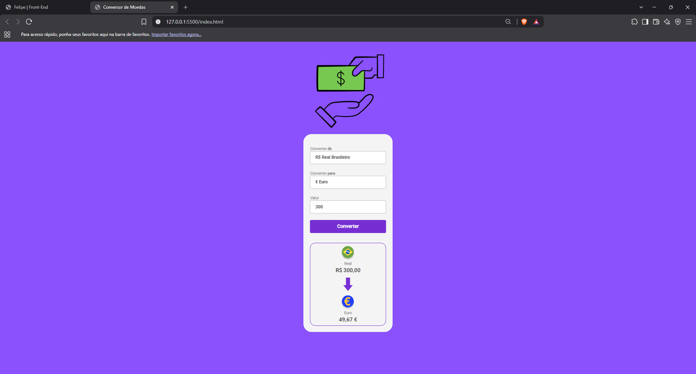

# 💱 Conversor de Moedas

Aplicação web desenvolvida com HTML, CSS e JavaScript para conversão de valores em Real Brasileiro (BRL) para Dólar Americano (USD), Euro (EUR) e Libra Esterlina (GBP), utilizando cotações obtidas através de uma API.

## 📸 Prévia


## 🚀 Funcionalidades

- Conversão do Real Brasileiro para:
  - 🇺🇸 Dólar Americano
  - 🇪🇺 Euro
  - 🇬🇧 Libra Esterlina
- Consulta de cotações através de API
- Atualização dinâmica da moeda selecionada
- Alteração da bandeira e nome da moeda
- Formatação dos valores de acordo com a moeda
- Interface responsiva

## 🛠️ Tecnologias

- HTML5
- CSS3
- JavaScript
- Fetch API
- Async/Await
- Intl.NumberFormat
- AwesomeAPI

## 📚 Conceitos praticados

Durante o desenvolvimento deste projeto, foram praticados conceitos importantes de desenvolvimento Front-End, como:

- Manipulação do DOM
- Eventos com `addEventListener`
- Consumo de APIs utilizando `fetch`
- Requisições assíncronas com `async/await`
- Conversão e tratamento de dados
- Formatação de valores monetários
- Alteração dinâmica de elementos da interface
- Organização de arquivos e estrutura de um projeto web

## 🔗 API

As cotações utilizadas na aplicação são obtidas através da **AwesomeAPI**.

[Documentação da AwesomeAPI](https://docs.awesomeapi.com.br/)

## 💻 Como executar

### Pré-requisitos

Não é necessário instalar nenhuma dependência para executar o projeto.

### Executando localmente

1. Clone o repositório:

```bash
git clone https://github.com/Felipe-Salgado12/conversor-de-moedas.git
```

## 🎯 Objetivo
Este projeto foi desenvolvido durante meus estudos de desenvolvimento Front-End, com o objetivo de praticar JavaScript, consumo de APIs e manipulação do DOM, além de consolidar conhecimentos fundamentais para o desenvolvimento de aplicações web.

## 👨‍💻 Autor

**Felipe Salgado**

- GitHub: [Felipe-Salgado12](https://github.com/Felipe-Salgado12)
- LinkedIn: [Felipe Salgado](https://www.linkedin.com/in/felipesalgado12/)
